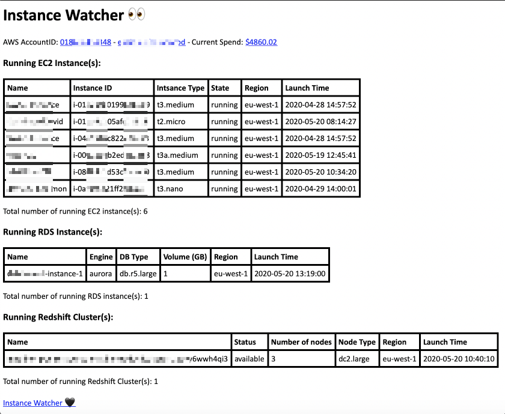
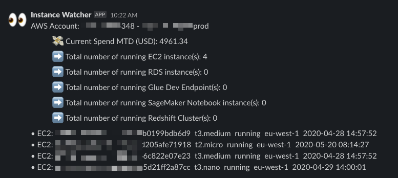
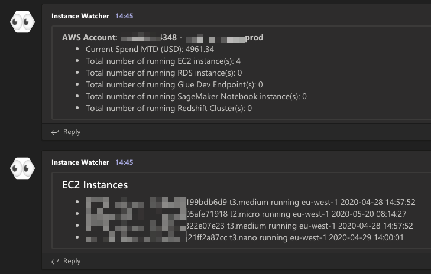

# Instance Watcher :eyes:


## Introduction

Instance Watcher will send you once a day a recap notification with the list of the running instances on all AWS regions for a given AWS Account.

Useful for `non-prod`, `lab/training`, `sandbox`, or `personal` AWS accounts, to get a kindly reminder of what you've left running. :money_with_wings:

Currently, It covers the following AWS Services:

- EC2 Instances
- RDS Instances
- SageMaker Notebook Instances
- Glue Development Endpoints
- Redshift Clusters

Notifications could be:

- Slack Message
- Microsoft Teams Message
- Email

## Features

- Customizable Cron Schedule
- Whitelisting capabilities
- Month to Date (MTD) Spending
- Forecasted Monthly Spend
- Slack Notifications *(Optional)*
- Microsoft Teams Notifications *(Optional)*
- Emails Notifications *(Optional)*
- Serverless Architecture
- Automated deployment using (IaC)
- Email Notification on Lambda Error

## Sneak Peek

### Email Notification



### Slack Notification



### Teams Notification



## Requirements

> AWS SES: Before you can send an email using Amazon SES, you must verify the address or domain that you are sending the email from to prove that you own it. If you do not have production access yet, you also need to verify any email addresses that you send emails to except for email addresses provided by the Amazon SES mailbox simulator.

## Deployment

Change default settings in `Makefile` or use directly the command-line with parameters.

> Nb: Recipients are **space-delimited**

### Parameters

```bash
Project ?= my_project_name
Recipients := my_target_email@domain.com my_second_target@domain.com
Sender := my_source_email@domain.com
EnableMail := 1
EnableSlack := 0
SlackWebHook := "your_webhook_here"
EnableTeams := 0
TeamsWebHook := "your_webhook_here"
WhitelistTag := watcher
CronSchedule := 0 18 * * ? *
```

### Deployment steps

        $ make layer
        $ make package Project=<your_project_name>
        $ make verify-sender
        $ make deploy

*Nb: Use emails in the command line is optional if you've already set up in the `Makefile`*

## Whitelisting

If you want to whitelist a specific instance to be hidden from the daily report, you will need to add the following tag to the instance.

| Key | Value |
|:---:|:-----:|
| `watcher` | `off` |

*nb: Tag `Key` is customizable in `Makefile`*

## Destroy

        $ make tear-down